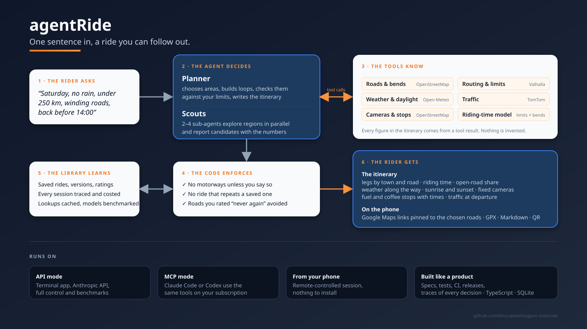

# agentMotoride

[](https://github.com/bhoudebert/agent-motoride/actions/workflows/ci.yml)
[](https://github.com/bhoudebert/agent-motoride/actions/workflows/codeql.yml)
[](https://github.com/bhoudebert/agent-motoride/releases)
[](.nvmrc)
[](LICENSE)
[](CONTRIBUTING.md)

A motorcycle ride planner driven by an AI agent. You say what you want in one
sentence:

> This Saturday, no rain, under 250 km, winding roads, give me an itinerary

and you get a ride you can follow: the loop, the roads, estimated riding time,
how much of it is open road, the forecast along the way, sunrise and sunset,
fixed speed cameras, where to fuel and where to stop for coffee, and the links
and files to put it on your phone.

The agent decides where to look and what to propose. Everything it states comes
from tools: road geometry and speed limits from OpenStreetMap, routing from
Valhalla, forecasts from Open-Meteo, traffic from TomTom when you have a key.
The code enforces your hard rules (no motorways unless you say so, a saved ride
is never silently duplicated) and keeps a library of rides you liked, with
ratings, so the next ride is different and better.

It is also a working example of an agentic application: tool use, parallel
sub-agents ("scouts"), schema-validated answers, a replayable trace of every
step, cost accounting and a benchmark of models, and the same tools exposed
over the Model Context Protocol.



## Two ways to run it

The planning model can come from two places. The tools, the library, the
exports and the data are the same in both.

|                     | API mode                                            | MCP mode                                                                                |
| ------------------- | --------------------------------------------------- | --------------------------------------------------------------------------------------- |
| What runs the agent | This app, through the Anthropic API                 | Claude Code or Codex CLI (any MCP client), using this app as a tool server              |
| What you pay with   | An Anthropic API key, per token                     | Your Claude Code or Codex plan; scouts still use the key if set                         |
| How you talk to it  | A terminal app with a menu and a `refine>` prompt   | Slash commands in Claude Code, e.g. `/mcp__ride__plan-ride ...`                         |
| Planning guidance   | A real system prompt, schema-validated final answer | The same instructions sent as the prompt's text; free-text answer                       |
| Model and effort    | `RIDE_MODEL`, `RIDE_EFFORT` in `.env`               | The MCP client's own model                                                              |
| Best for            | Full control, benchmarks, scripted runs             | Daily use on a subscription, chatting about rides, and the phone through Remote Control |

Start with the one that matches what you have: an API key, Claude Code or
Codex.

**From your phone, with nothing to install**: a Claude Code session running on
any machine (your computer, a Raspberry Pi, a VPS) can be driven from the Claude
app or claude.ai, with this server attached. See
[From your phone: Remote Control](#from-your-phone-remote-control).
For the equivalent Codex workflow in the ChatGPT mobile app, see
[From your phone with Codex](#from-your-phone-with-codex).

Whatever the mode, `npm run check` tells you what is missing and whether the
data services answer from your machine.

### API mode, in three commands

```bash
npm install
cp .env.example .env            # set ANTHROPIC_API_KEY and RIDE_HOME
npm run ride                    # start menu: plan a new ride or open a saved one
```

Or plan directly:

```bash
npm run ride -- --from "Grenoble" "this Saturday, no rain, under 250 km, winding roads"
```

### MCP mode, in three steps

```bash
npm install
cp .env.example .env            # set RIDE_HOME; ANTHROPIC_API_KEY only if you want scouts
claude                          # start Claude Code in this directory; approve the "ride" server
```

Then in Claude Code:

```
/mcp__ride__help
/mcp__ride__plan-ride this Saturday, no rain, under 250 km, winding roads
```

Details for each mode: [Usage](#usage) for the terminal app, [MCP mode](#mcp-mode-the-tools-in-claude-code-or-any-mcp-client) for Claude Code.

## What you get

- **An itinerary** built from real data: legs with town names and main roads, distance, estimated riding time and average speed, open-road share, time at 70 km/h or more, slow-zone shares against your targets, daylight, weather by time of day, traffic, fixed cameras, a stop plan with times, navigation links.
- **A library of saved rides**, versioned, rated, with everything above stored and refreshable, and a rule that keeps new rides from repeating old ones.
- **Exports**: Google Maps links pinned to the chosen roads, GPX for navigation apps (Liberty Rider, Kurviger, Garmin, TomTom), a Markdown document per ride, a QR code and a phone page on your Wi-Fi.
- **Accounting**: every run logged with tokens, cost and result; every step replayable; a model benchmark with recommendations.

## Requirements

- Node.js 24 or newer. The TypeScript sources run directly, there is no build step.
- API mode: an Anthropic API key from <https://platform.claude.com/>, billed per token.
- MCP mode: Claude Code (or another MCP client). No API key needed, except for scouts.
- Internet access to the public data services listed under [Tools](#tools).
- Optional: a TomTom API key (free tier at <https://developer.tomtom.com/>) for traffic checks.

## Project conventions

|                     |                                                                                                                                                                                                                                                                             |
| ------------------- | --------------------------------------------------------------------------------------------------------------------------------------------------------------------------------------------------------------------------------------------------------------------------- |
| Quality gate        | `npm run quality`: typecheck, lint, format check, unit tests. Runs in CI on every pull request                                                                                                                                                                              |
| Formatting and lint | ESLint (`eslint.config.js`) and Prettier (`.prettierrc.json`); `npm run lint:fix` and `npm run format`                                                                                                                                                                      |
| TypeScript          | 7 (native compiler) for `tsc`; 6 as the API package for ESLint and editors, per the TypeScript 7 side-by-side guidance                                                                                                                                                      |
| Commits             | Conventional Commits with the full type set (`feat`, `fix`, `perf`, `refactor`, `docs`, `test`, `build`, `ci`, `chore`, `style`, `revert`) and kebab-case scopes, enforced by a commit-msg hook and in CI; rules and examples in `CONTRIBUTING.md`. Agents read `AGENTS.md` |
| Hooks               | installed by `npm install`: lint-staged on pre-commit, commitlint on commit-msg                                                                                                                                                                                             |
| Releases            | release-please maintains a release PR with changelog and version; merging it tags the release                                                                                                                                                                               |
| Dependencies        | Dependabot, weekly, grouped dev tooling                                                                                                                                                                                                                                     |
| Specs               | `openspec/`, updated before behaviour changes                                                                                                                                                                                                                               |
| Contributing        | `CONTRIBUTING.md`; security notes in `SECURITY.md`; MIT licence                                                                                                                                                                                                             |

## Licence, data and disclaimer

Open source under the MIT licence. The planner relies on public data and
services with their own licences, in particular OpenStreetMap (© OpenStreetMap
contributors, ODbL) and Open-Meteo (CC BY 4.0); see `NOTICE.md` for the full
list, the attribution each requires, and the usage policies of the public
instances.

Trademarks and product names mentioned here (Claude, Codex, Google Maps,
Liberty Rider, TomTom and others) belong to their owners; this project is
independent and not affiliated with or endorsed by any of them.

The app is a planning aid, not a navigation system: riding times are
estimates, public data can be wrong or outdated, and the rider is responsible
for the ride and for complying with the law, including local rules on
speed-camera information. Full text in `NOTICE.md`.

## Documentation map

| Where                                 | What                                                                                   |
| ------------------------------------- | -------------------------------------------------------------------------------------- |
| This README                           | How to install, use and configure both modes; how it works; benchmark; troubleshooting |
| `openspec/project.md`                 | Project context: purpose, stack, conventions, constraints                              |
| `openspec/specs/<capability>/spec.md` | What the system does, as requirements with scenarios, one file per capability          |
| `.env.example`                        | Every setting with its default                                                         |

## Setup

```bash
npm install
cp .env.example .env
```

Then edit `.env`:

| Variable               | Required | Purpose                                                                   |
| ---------------------- | -------- | ------------------------------------------------------------------------- |
| `ANTHROPIC_API_KEY`    | API mode | Anthropic API key. In MCP mode only needed for scouts                     |
| `RIDE_HOME`            | no       | Default start and end point, e.g. `Grenoble`. Overridden by `--from`      |
| `TOMTOM_API_KEY`       | no       | Enables `getTraffic`. Without it the agent reports traffic as not checked |
| `RIDE_ALLOW_MOTORWAYS` | no       | `1` to permit motorways. Default: never used                              |
| `RIDE_MAX_30_PCT`      | no       | Target max % of distance in zones of 30 km/h or less. Default `3`         |
| `RIDE_MAX_50_PCT`      | no       | Target max % of distance in 31-50 km/h zones. Default `20`                |
| `RIDE_MODEL`           | no       | Model ID, default `claude-opus-5-5`                                       |
| `RIDE_EFFORT`          | no       | Reasoning effort: `low`, `medium`, `high`, `xhigh`, `max`. Default `high` |

`.env` is git-ignored. Never commit it.

## Usage

This section is the terminal app, API mode. For Claude Code, see
[MCP mode](#mcp-mode-the-tools-in-claude-code-or-any-mcp-client).

Two ways to start:

```bash
npm run ride                      # start menu
npm run ride -- [options] "..."   # plan directly
```

The start menu offers:

```
agentMotoride
  1. Plan a new ride
  2. Open a saved ride (3 saved)
  q. Quit
```

- **Plan a new ride** asks what you want and the start point, then plans.
- **Open a saved ride** lists the library, shows the ride you pick (legs, main
  roads, map link, itinerary), then offers `[e] edit`, `[g] export GPX`,
  `[r] rate`, `[b] back`.
  Edit opens the free prompt on that ride. Looking at a ride, and opening the
  prompt on it, make no API call; the first call happens when you type a
  request.

To display a saved ride without the menu: `npm run ride -- --show 3`.

Direct planning:

```bash
npm run ride -- --from "Grenoble" "Roadtrip moto this Saturday, no rain, <250km, winding roads, give me an itinerary"
```

- `--from <place>`: start and end point. A town (`"Florac, France"`), a street
  or address (`"Avenue de Bretagne, Lille"`) or `"lat,lon"`. Required unless
  `RIDE_HOME` is set.
- `--allow-motorways`: permit motorways (autoroutes), for example for a commute.
  By default they are never used.
- `--max-30-pct <n>`: target ceiling for the share of the distance in zones
  limited to 30 km/h or less. Default 3.
- `--max-50-pct <n>`: target ceiling for the share in 31-50 km/h zones. Default 20.
- `--show <id|name>`: display a saved ride and exit. No planning, no API call.
- `--ride <id|name>`: work on a saved ride. With a request, apply it; without,
  open the prompt on the ride.
- `--allow-repeat`: accept rides that repeat saved ones.
- `--save-as <name>`: save the first itinerary under this name.
- `--once`: print the itinerary and exit, without the refine prompt.
- The quoted sentence is free text. Relative dates such as "this Saturday" work
  because the app tells the model today's date.
- `npm run ride -- --help` prints usage.

The itinerary is printed on stdout. Tool calls are traced on stderr as they
happen, followed by token usage:

```
  -> searchRoads({"location":"Villard-de-Lans","radiusKm":30})
     ok, 3120 ms
  -> getWeather({"location":"Villard-de-Lans","date":"2026-10-03"})
     ok, 240 ms
  -> calculateTrip({"waypoints":["Grenoble","45.07,5.55","Die"],"roundTrip":true})
     ok, 610 ms
...
[claude-opus-5-5, 48210 tokens in, 3904 out]
```

To keep only the itinerary: `npm run ride -- ... --once 2>/dev/null`.

### Refining the itinerary

After the itinerary the program stays open on a `refine>` prompt. Type a change
in plain words and the agent edits the current ride:

```
refine> too long, keep it under 180 km
refine> leave at 10:00 instead and add a lunch stop around Die
refine> skip the D 1075, too much traffic
refine> what is the weather like if I go Sunday instead?
```

The whole conversation is kept, including every tool result, so a follow-up
reuses what was already looked up and only calls tools for what the change
affects.

Leaving is always explicit:

| Action                    | Effect                                                                                                             |
| ------------------------- | ------------------------------------------------------------------------------------------------------------------ |
| `/back` or Ctrl-D         | Leave this ride and return to the start menu. In the menu, Ctrl-D steps back one level and quits only from the top |
| `/quit`, `exit` or Ctrl-C | Quit the program                                                                                                   |
| Enter on an empty line    | Nothing                                                                                                            |

Leaving with an itinerary that is not saved asks once for confirmation: `/save`
it, or repeat the command to discard it.

- The conversation lives in memory only. Quitting ends it. Save the ride first
  (`/save`) to pick it up again later with `--ride`.
- The slow-zone targets set by flags stay fixed for the session. Motorways can
  be switched with `/motorways on` or `/motorways off`; asking for motorways in
  plain words while they are forbidden has no effect, by design.
- The prompt appears only in an interactive terminal. With piped input or
  output, or with `--once`, the program exits after the first answer.
- Each follow-up is billed. The conversation prefix is cached, which makes
  follow-ups much cheaper than the first run.

A run typically takes one to a few minutes and several tool rounds. Cost
depends on how many areas the model explores; the token line at the end lets
you compute it from current pricing.

## Saved rides

Rides are kept in a SQLite file, `data/agentmotoride.db` (git-ignored; override the
path with `RIDE_DB`). Nothing is saved unless you ask.

### Saving

At the `refine>` prompt:

| Command                                                  | Effect                                                                                                                                                                                |
| -------------------------------------------------------- | ------------------------------------------------------------------------------------------------------------------------------------------------------------------------------------- |
| `/save [name]`                                           | Save the current itinerary. Without a name, the agent's own short title is used. Saving again after a change creates a new version linked to the previous one; nothing is overwritten |
| `/list`                                                  | Saved rides                                                                                                                                                                           |
| `/show [id\|name]`                                       | Legs, main roads, map link and full itinerary of a saved ride. No argument: the ride loaded or saved in this session                                                                  |
| `/gpx [file]`                                            | Export the itinerary on screen, or the loaded ride, as a GPX file                                                                                                                     |
| `/md [file]`                                             | Markdown document of the saved ride of this session                                                                                                                                   |
| `/qr`                                                    | QR code of the Google Maps link, to scan with the phone                                                                                                                               |
| `/share`                                                 | Page for the phone on the local Wi-Fi: map link, itinerary, GPX download, with its QR code                                                                                            |
| `/rate <0-5> [note]`                                     | Rate the ride saved or loaded in this session; 0 means never again                                                                                                                    |
| `/motorways on\|off`                                     | Permit or forbid motorways from now on                                                                                                                                                |
| `/settings`                                              | Show motorways state, slow-zone targets, traffic check, model and effort, bike profile                                                                                                |
| `/bike [range=.. reserve=.. pause=.. stint=.. lunch=..]` | Show or set the bike profile used to plan stops                                                                                                                                       |
| `/usage`                                                 | Model, tokens, time and estimated cost of this session so far                                                                                                                         |
| `/trace`                                                 | Replay this session's steps so far                                                                                                                                                    |
| `/back`                                                  | Return to the start menu (also Ctrl-D)                                                                                                                                                |
| `/quit`                                                  | Quit the program                                                                                                                                                                      |
| `/help`                                                  | Command list                                                                                                                                                                          |

Without the prompt: `npm run ride -- --once --save-as "Vercors loop" "..."`.

What is stored: name, start point, ride date and departure, waypoints, each leg
with its coordinates, distance, time and main roads, the speed-limit profile,
the preferences used, your requests, the itinerary text, the exact route line,
the route's footprint on a 500 m grid, what the planning session consumed, and,
gathered right after the save and on every refresh: daylight, the forecast at
four points of the route for the ride date, fixed cameras, fuel and café
shortlists, and the stop plan.

Every answer carries, next to the text, the id of the routed trip it presents
(validated by the API against a schema). `/save` uses that id, so the saved
distances and geometry come from the routing result, not from the model's prose.

### Managing the library

```bash
npm run rides -- list
npm run rides -- show 3
npm run rides -- rate 3 5 "superb, Col de Rousset empty"
npm run rides -- rate-leg 3 2 0 "gravel, never again"
npm run rides -- export 3         # GPX file for a GPS app
npm run rides -- export-md 3      # Markdown document, the standard full view
npm run rides -- bike range=250   # bike profile for stop planning
npm run rides -- today 3          # ride-day briefing, go or no-go
npm run rides -- qr 3             # QR code of the map link
npm run rides -- share 3          # phone page on the local Wi-Fi, until Ctrl-C
npm run rides -- runs             # every planning session: model, tokens, cost, result
npm run rides -- refresh 3        # route it again; recompute times, road mix, leg names, daylight, weather, cameras, stops, stop plan
npm run rides -- refresh 3 --stops  # only rebuild the stop plan (after a bike profile change); instant once cached
npm run rides -- refresh all
npm run rides -- delete 3
npm run rides -- clear-cache
```

### Exporting to a GPS app (GPX)

```bash
npm run rides -- export 3                  # writes exports/3-<name>.gpx
npm run rides -- export 3 ~/ride.gpx       # or a path you choose
```

Also `/gpx [file]` at the `refine>` prompt, which exports the itinerary on
screen even before it is saved, and `[g] export GPX` in the start menu after
opening a saved ride.

The file is standard GPX 1.1 and holds the ride three ways, so any app finds
what it reads:

| In the file | What it is                                                                                                                                                                         | Used by                                                                        |
| ----------- | ---------------------------------------------------------------------------------------------------------------------------------------------------------------------------------- | ------------------------------------------------------------------------------ |
| Track       | The exact road line from the router, one segment per leg                                                                                                                           | Apps that follow a line                                                        |
| Route       | The loop's stops, the planned fuel and pause stops as named stages, and pass-through points taken from the exact line where an app would otherwise cut away (40 points by default) | Apps that compute their own path between points: Liberty Rider, Garmin, TomTom |
| Waypoints   | The stops and the planned stops as named markers, with their time                                                                                                                  | Shown as markers                                                               |

Import it in a motorcycle or outdoor navigation app (Liberty Rider, Kurviger,
Calimoto, OsmAnd, Scenic) or a Garmin or TomTom unit. An app that follows the
track keeps the exact line. An app that recomputes its own path between points
(Liberty Rider does, by its own documentation) stays on the planned roads
thanks to the pass-through points; one or two may still need a nudge by hand.

```bash
npm run rides -- export 6 --pins 15        # fewer route points: shorter stage list, a little more drift
```

Liberty Rider shows the route points as numbered stages without names, so the
export, the ride view and the Markdown say where each planned stop sits in that
list ("pause: ... route point 22 of 40") and where it is in words (name, road,
village). The number holds as long as the file is exported with the same
`--pins` value.

Waze and Google Maps navigation cannot import GPX. For Google Maps, use the map
link in the itinerary; for speed-camera alerts next to it, run an alert app
(Waze without a destination, Radarbot) in the background.

Rides saved before this feature did not store the route line. Exporting one
routes it again from its waypoints and then keeps the line; the result can
differ slightly from the original if map data changed in between.

### Exporting a ride as Markdown

```bash
npm run rides -- export-md 6            # writes exports/6-<name>.md
npm run rides -- export-md 6 ~/rides/eau-d-heure.md
npm run rides -- show 6 --md            # same document on stdout
```

Also `/md [file]` at the `refine>` prompt (on the saved ride of the session),
`exportMarkdown` and `/mcp__ride__export-md` in MCP mode.

The document is the standard full view of a ride, in a fixed layout: title and
headline figures, date and start, request, map link, figures, road mix with the
70 km/h readings, legs table with main roads and ratings, daylight, fixed
cameras (one line per spot, doubled entries marked), fuel and café stops with
opening hours, planning metadata, and the itinerary text as the planner wrote
it. Plain Markdown with tables, so it versions cleanly in git next to the GPX.

### Bike profile and stop plan

Stops are chosen, not just listed, from a small profile of the bike and the
rider's rhythm, kept in the database:

```bash
npm run rides -- bike                                   # show
npm run rides -- bike range=250 reserve=40 pause=75 stint=90 lunch=yes
```

| Setting   | Default | Used for                                                             |
| --------- | ------- | -------------------------------------------------------------------- |
| `range`   | 250 km  | Realistic range on a full tank                                       |
| `reserve` | 40 km   | Fuel before range minus reserve, so the tank never runs into reserve |
| `pause`   | 75 min  | A café or bakery stop after this much riding since the last stop     |
| `stint`   | 90 min  | Warning when no stop can be placed within this stretch               |
| `lunch`   | yes     | A restaurant where the ride crosses 12:30, when it spans midday      |

Also `/bike` at the prompt, and the same fields in `rideSettings` in MCP mode.
"I leave with half a tank" in the request shifts the first fuel stop.

The planner calls `planStops` on the final loop. The plan gives each stop a
kind, a name, a km mark, an arrival time and a reason, plus the return time
with breaks and warnings (no fuel in reach, long stint, no restaurant near
midday). Saved rides get their plan at save and at `refresh`, shown in the
view and the Markdown.

On the bike, the stops are in what the phone already has: the navigation links
include them as waypoints, so they are announced in turn, and the GPX carries
them as named waypoints.

### Ride-day briefing

```bash
npm run rides -- today            # the next dated ride
npm run rides -- today 6          # a given ride
```

Also `/mcp__ride__today [id]` in Claude Code. No planning, no model: the
briefing re-checks what can change between planning and riding, and ends with
a verdict:

- daylight for the day and the return time with breaks against the last light;
- the stop plan rebuilt with the current profile, each stop checked against its
  opening hours at the arrival time ("open at arrival", "CLOSED at arrival",
  "hours not known"); a closed place is replaced by an open one nearby when the
  map has one;
- the forecast now, at four points of the route for the riding hours: rain,
  temperature, gusts;
- traffic at the departure time, when `TOMTOM_API_KEY` is set;
- the fixed cameras stored on the ride.

`GO`, `GO with caution` (rain risk, strong gusts, cold, tight daylight, traffic
delay, a warning from the stop plan) or `NO-GO as planned` (rain likely, a stop
closed, return after dark), with the reasons listed.

Opening hours are read from OpenStreetMap tags in their common forms (`24/7`,
day ranges with time ranges, `off`). A tag the reader cannot parse counts as
"hours not known", never as open.

### Navigation links that stay on the chosen roads

A Google Maps link through the waypoints alone lets Google compute its own
fastest path between them, which is how it drifts off a chosen D-road on a
long leg. The links the app produces now add pass-through points taken from the
exact route line, at the places where a fastest-path router would cut away
(the points farthest from the straight line between two stops). Google accepts
about ten points per link on the phone, so a long loop gets two or more links,
"part 1" and "part 2", sharing their boundary point. Planned stops take part of
the same budget.

The GPX track is exact regardless; when a GPS app shows a different route from
the GPX, it is recalculating from the route points, and choosing "follow the
track" in that app fixes it.

### Handing a ride to the phone

- **`/qr`** (or `npm run rides -- qr 3`) prints a QR code of the Google Maps
  link. Scan it, tap, navigate.
- **`/share`** (or `npm run rides -- share 3`) starts a small web page on your
  computer, reachable from a phone on the same Wi-Fi, and prints its QR code.
  The page has the map link, the itinerary text and a GPX download. It follows
  the current itinerary while the session runs and stops when you quit. Nothing
  leaves the local network. Port `RIDE_SHARE_PORT`, default 8787.

### Cameras, stops and daylight

Once a loop is chosen, the agent completes it with three more lookups, all from
free sources:

- **Fixed speed cameras** on or beside the route, from OpenStreetMap, with the
  km mark along the ride, the leg, the posted limit and direction. Fixed
  installations only: mobile controls are not in any map, and an unmapped
  camera is not shown. In France exact positions are legally sensitive; the
  itinerary presents them as places to watch the speed.
- **Stops**: fuel stations, cafés, restaurants and bakeries within a short
  detour, spread along the whole route (not only the first town), with opening
  hours when mapped. The agent places a fuel stop within tank range and a pause
  at a sensible point, and names them with their km mark.
- **Daylight**: sunrise, sunset, first and last usable light for the ride day,
  computed locally for any date, so a ride in 2027 gets correct times (winter
  and summer time included). The agent plans departure and return inside it.

### Time at 70 km/h or more

Every routed trip reports two readings of the rider's own yardstick:

| Figure                | Meaning                                                                                                                        |
| --------------------- | ------------------------------------------------------------------------------------------------------------------------------ |
| time on 70+ roads     | share of riding time on roads limited to 70 km/h or more                                                                       |
| time at 70+ estimated | share of riding time at an estimated 70 or more, which needs limits of 80 and up since bends and junctions take a few km/h off |

Both appear in the itinerary, in the saved-ride view ("Road mix" line) and in
the runs table (`70+t%`, the first reading).

### How saved rides shape later planning

- **No duplicates, enforced.** Every routed candidate is compared with the saved
  rides by the share of its 500 m grid cells they already cover. At 70% or more
  it is a duplicate: the agent must look elsewhere, and a save is refused
  (`/save --force`, or `force` on the MCP tool, overrides it for a deliberate
  copy). From 40% it is flagged as similar and mentioned. The same roads ridden
  in the opposite direction count as the same ride. A new version of a ride
  being edited is not a duplicate of it. `--allow-repeat` lifts the planning
  rule for a session, not the save check.
- **Ratings steer the choice.** Ratings run from 0 to 5. The agent reads the
  library at the start; legs and rides rated 4-5 are reused as building blocks.
  Roads from rides or legs rated 0 ("never again") or 1 are avoided: every
  routed trip reports the share of its distance on such roads, and a loop with
  10% or more on them is only acceptable when nothing else meets the hard
  limits, which the agent must say. A leg's own rating wins over the ride's.
  Unrated rides only count for duplicate detection.
- **Weather is never reused for planning.** A saved ride carries the last
  forecast gathered, for reading; a new plan or an edit always checks the
  forecast afresh for the day in question.

### Viewing and editing a saved ride

```bash
npm run ride -- --ride 3                 # open the prompt on ride 3, nothing sent yet
npm run ride -- --ride 3 "next Sunday, 50 km longer, lunch in Die, skip Mens"
```

Without a request, the ride is loaded and the `refine>` prompt opens at once.
Type a change, a new date, or a plain question about the ride; `/show` displays
it again. Same thing from the start menu: open a saved ride, then `[e] edit`.

With a request, it is applied straight away.

Either way the session works from the saved waypoints and legs instead of
searching for an area. A change or a new date makes the agent route the ride
again and check the weather for that day. Overlap with the ride being edited is
expected and not treated as a duplicate. `/save` stores the result as a new
version; the original stays.

In a script (no terminal, or `--once`), `--ride 3` with no request replans the
ride for the coming weekend.

### Lookup cache

Tool results are cached in the same file so repeated planning does not hit the
public servers again:

| Lookup                             | Kept for | Why                                                          |
| ---------------------------------- | -------- | ------------------------------------------------------------ |
| Road search                        | 30 days  | Roads rarely change, and this is the slowest call            |
| Routed trip                        | 7 days   | Stable, but closures and map edits happen                    |
| Fixed cameras, stops along a route | 30 days  | Keyed by the route line, so a refresh or a replan is instant |
| Daylight                           | 1 year   | Astronomy does not change                                    |
| Place names for coordinates        | 1 year   | Neither do village names                                     |
| Weather                            | 1 hour   | Only to avoid repeat calls within one session                |
| Traffic                            | never    | Must be live                                                 |

A cached lookup shows as `(from cache)` in the trace. `npm run rides --
clear-cache` empties it.

## Model, cost and benchmarking

Model and effort are set in `.env`:

| Setting       | Values                                                               | Notes                                                                                                          |
| ------------- | -------------------------------------------------------------------- | -------------------------------------------------------------------------------------------------------------- |
| `RIDE_MODEL`  | `claude-opus-5-5` (default), `claude-sonnet-5-5`, `claude-haiku-4-5` | Roughly $4/$20, $2/$10 and $1/$5 per million input/output tokens                                               |
| `RIDE_EFFORT` | `low`, `medium`, `high` (default), `xhigh`, `max`                    | How much the model thinks and how many tool rounds it makes. Haiku ignores it and uses a fixed thinking budget |

The settings line at session start shows which model and effort are in use, and
`/usage` shows what the session has consumed so far.

Every planning session is logged to the `runs` table, whether or not the ride
was saved and whether or not it failed: model, effort, turns, model calls, tool
calls, tokens (input, cache reads, output), wall time, estimated cost, and the
resulting ride's distance, riding time, open-road share and slow-zone shares.

```bash
npm run rides -- runs          # comparison table
npm run rides -- runs --csv    # for a spreadsheet
```

A saved ride also records what its session had consumed when it was saved; it
shows as a "Planned with" line in the ride view.

To compare models fairly: use the same request and start point for each, plan
without saved rides in the way (`--allow-repeat`, or a scratch database with
`RIDE_DB`), and clear the lookup cache between runs (`npm run rides --
clear-cache`), otherwise later runs get roads and routes for free. Compare cost
against the ride you got, not cost alone.

Cost is an estimate from list prices in `src/usage.ts`, not your invoice.

## Choosing a model: benchmark results

Short version: **use `claude-sonnet-5-5`**. Effort `medium` for speed and price,
`high` for consistency. Opus and Haiku are not worth it for this app.

### What was measured

One request, planned from scratch five times on 2026-10-02 with an empty ride
library, from the same start point:

> Roadtrip moto this Saturday, no rain, <250km - less than 3h, ideally 2h30,
> winding roads, avoid motorways, avoid 30 km/h roads, limit 50 km/h towns as
> much as possible, most of the time riding over 70 km/h.

| Setup                      | Cost  | Time  | Model calls | Tool calls | Ride         | Open road | 50 zones | 30 zones |
| -------------------------- | ----- | ----- | ----------- | ---------- | ------------ | --------- | -------- | -------- |
| Opus 5.5, high             | $0.40 | 272 s | 12          | 20         | 164 km, 2h44 | 77.2%     | 22.1%    | 0.8%     |
| Sonnet 5.5, high           | $0.17 | 230 s | 10          | 16         | 156 km, 2h39 | 76.3%     | 21.9%    | 1.8%     |
| Sonnet 5.5, medium (run A) | $0.08 | 37 s  | 6           | 8          | 151 km, 2h39 | 77.8%     | 19.1%    | 3.1%     |
| Sonnet 5.5, medium (run B) | $0.11 | 58 s  | 6           | 10         | 134 km, 2h24 | 66.8%     | 32.0%    | 1.2%     |
| Haiku 4.5                  | $0.12 | 342 s | 17          | 22         | 201 km, 3h24 | 72.8%     | 25.5%    | 1.7%     |

Targets were at most 20% of the distance in 50 zones and 3% in 30 zones, with a
hard limit of 3 hours of riding.

### What it shows

- **Opus buys nothing here.** Sonnet at high effort produced a ride of the same
  quality for 41% of the price. The hard parts of this app (routing, speed
  limits, time estimate, duplicate detection) are done in code; the model
  orchestrates and judges, which does not need the top model.
- **Haiku is a false economy.** It is the cheapest per token, but it needed 17
  model calls, so it cost more than Sonnet at medium, was the slowest, and
  returned a 3h24 ride against a 3 hour limit.
- **Sonnet at medium is fast and cheap, but uneven.** One run gave the best ride
  of the whole benchmark, the other a poor one (32% in 50 zones). It explores
  less (8 to 10 tool calls against 16 to 20) and sometimes settles early.
- **The rides converge.** Three setups landed near 77% open road and 20 to 22%
  in 50 zones. That is most likely the ceiling of the terrain around the start
  point, not of the model: a bigger model does not find roads that are not there.
- **Where the money goes.** Each model call resends the whole conversation, so
  cost follows the number of calls and the size of tool results more than the
  final answer. Prompt caching already cuts that re-reading to a small fraction;
  thinking tokens, driven by effort, are the largest single line.

### Recommended settings

| Situation                           | `RIDE_MODEL`        | `RIDE_EFFORT` | Expect                                                          |
| ----------------------------------- | ------------------- | ------------- | --------------------------------------------------------------- |
| Everyday use                        | `claude-sonnet-5-5` | `medium`      | About $0.10 and under a minute for a new ride. Check the result |
| You want it right first time        | `claude-sonnet-5-5` | `high`        | About $0.17 and 4 minutes                                       |
| Editing or questioning a saved ride | `claude-sonnet-5-5` | `medium`      | A few cents                                                     |

With `medium`, look at the open-road and 50 zone shares of the itinerary before
accepting it. When they are poor, ask for better at the `refine>` prompt ("too
many 50 zones, find a better loop"): a refinement costs a few cents, so Sonnet
at medium plus one retry is still far below a single Opus run.

Free in every setup: the start menu, viewing saved rides, rating, `refresh`.

### Limits of this benchmark

- **Small sample.** One run per setup, two for Sonnet at medium. Models are not
  deterministic: the same setup gives a different ride and cost each time. Treat
  the table as a strong hint, not a proof.
- **One request, one region.** A mountain area, a commute or a looser request
  may rank the setups differently.
- **The stated goal was not measured.** The request asked for most of the time
  above 70 km/h. No run reports that share, and all five rides average 56 to
  60 km/h. Open-road share is the closest figure available.
- **Timing may be skewed.** The runs were minutes apart; if the lookup cache was
  not cleared between them, later runs got road searches for free. That affects
  seconds, not cost or ride quality.
- **Costs are estimates** from list prices at the time, and prices change.

### Run it yourself

```bash
export RIDE_DB=data/bench.db              # separate database, your rides stay untouched

# for each setup: edit RIDE_MODEL / RIDE_EFFORT in .env, then
npm run rides -- clear-cache              # so no run inherits lookups from the previous one
npm run ride -- --once --from "<your start>" "<your usual request>"

npm run rides -- runs                     # compare
unset RIDE_DB
```

Do not `/save` during a benchmark: a saved ride changes what the next run sees.
Use your own start point and your own kind of request; that is the only
benchmark that tells you what to pick. Three runs per setup give a picture, one
is an anecdote.

## MCP mode: the tools in Claude Code or any MCP client

The same tools run as a Model Context Protocol server, so a client with its own
model can plan rides with them: Claude Code, Codex CLI, or any other MCP client.
The client's model does the thinking on your existing plan; this server does
roads, routing, weather, traffic, saved rides and GPX. No API key is needed for
that part.

```bash
npm run mcp            # starts the server on stdio (a client launches this; not for typing into)
```

### Using it from Claude Code

The project ships a `.mcp.json`, so starting Claude Code in this directory
offers the server automatically (approve it when asked). To use it from
anywhere:

```bash
claude mcp add --scope user ride -- node --env-file-if-exists=/abs/path/agent-motoride/.env /abs/path/agent-motoride/src/mcp.ts
```

Then, in Claude Code:

```
/mcp__ride__plan-ride this Saturday, no rain, under 250 km, winding roads
```

That prompt carries the full planning instructions of the built-in planner, the
rider's settings and today's date. Plain requests work too ("use the ride tools
to plan…"), with less guidance.

### From your phone: Remote Control

Claude Code can hand a running session to the Claude mobile app or to
claude.ai in a browser. The session keeps running where it was started, with
its project, its `.mcp.json` and therefore this server, its library and its
exports; the phone is the keyboard and the screen. No app of ours, no bot, no
hosting of the server on the internet: a remote prompt on top of everything in
this README.

```bash
cd agent-motoride
claude remote-control        # prints a URL and a QR code
```

Scan the code with the Claude app (or open the URL on claude.ai), then ask as
in Claude Code: `/mcp__ride__plan-ride ...`, "show ride 7", "briefing for
ride 7", "save it". From inside a running session, `/rc` does the same.

Where the session runs is your choice:

| Machine                                           | Notes                                                                               |
| ------------------------------------------------- | ----------------------------------------------------------------------------------- |
| Your computer                                     | Zero setup; must stay awake while you are out                                       |
| A small always-on box at home (Raspberry Pi, NAS) | Clone the project there with `.env` and the database; the library lives on that box |
| A VPS                                             | Same, and the laptop is free; the library lives on the VPS                          |

Requirements, from the Claude Code documentation: a Pro, Max, Team or
Enterprise plan signed in with `/login` (an API key alone does not qualify);
not available through Bedrock, Vertex or a custom API base URL. MCP servers
from `.mcp.json` are documented as staying available in a remote-controlled
session.

Files: the session writes Markdown and GPX on the machine it runs on. At home,
`/share` gives the phone a page with the links and the GPX download. Away from
home, ask the session to show the ride's Markdown: the Google links in it open
on the phone directly.

Since the session is also a development session, new features can be asked
for, built and tried from the phone as well. Scouts, if enabled, still run on
the Anthropic key of that machine's `.env`.

Source: Claude Code documentation, Remote Control (code.claude.com/docs/en/remote-control).

### Using it from Codex CLI

Register the server once on every Codex host that should use it. The included
helper writes a user-level entry with absolute paths, so it works regardless of
which directory Codex starts in:

```bash
npm run codex:register
```

which runs `codex mcp add ride ... -- node --env-file-if-exists=<abs>/.env <abs>/src/mcp.ts`
and prints the one line still to add by hand in `~/.codex/config.toml`, under
`[mcp_servers.ride]`:

```toml
default_tools_approval_mode = "approve"
```

Without it Codex asks for a confirmation before every tool call, and a plan
makes twenty. `"writes"` is the middle ground: lookups run freely, saving and
settings changes still ask, based on the read-only annotations the tools carry.
The full example with comments is in `codex/config.example.toml`.

Then start `codex` and ask in plain words. Codex has no slash commands for MCP
servers: `/ride` does nothing, and `ride show 7` is taken for a shell command.
Say what you want instead:

```
show saved ride 7
plan me a ride this Saturday from YOUR_START_TOWN, no rain, under 220 km, winding roads
briefing for ride 7
```

The server's instructions tell the model that ride requests go to its tools,
never to the shell; add "using the ride tools" if it still reaches for a
terminal. `/mcp` in Codex shows the server as `ride: connected (19 tools)`.
What differs from Claude Code:

|                                            | Claude Code                 | Codex                                                                                                                                                              |
| ------------------------------------------ | --------------------------- | ------------------------------------------------------------------------------------------------------------------------------------------------------------------ |
| Tools                                      | all                         | all                                                                                                                                                                |
| Server instructions (the planning method)  | received                    | received                                                                                                                                                           |
| Slash commands (`plan-ride`, `today`, ...) | yes                         | no: Codex does not expose MCP prompts. The model fetches the same guidance through the `planningGuide` tool, which the instructions tell it to call for a new ride |
| Server discovery                           | from the repo's `.mcp.json` | this project uses a user-level `~/.codex/config.toml` entry, registered once per host                                                                              |
| Approval of tool calls                     | once per server             | per call unless `default_tools_approval_mode` is set                                                                                                               |
| What pays                                  | your Claude plan            | your Codex or ChatGPT plan; scouts still need the Anthropic key or `RIDE_SCOUTS=0`                                                                                 |

Everything else (library, duplicates, exports, traces in `rides runs`) is the
same server, so it behaves the same.

### From your phone with Codex

Codex Remote lets the ChatGPT mobile app control Codex on another computer.
The phone is the interface; the repository, commands, MCP process, `.env`, ride
database and exports stay on the connected host. Because `ride` is a local
stdio MCP server, it does **not** need a public URL or an open firewall port.

#### Recommended: pair the ChatGPT desktop app

1. On the Mac or Windows host that will run Codex, clone this repository, run
   `npm install`, create `.env`, and run `npm run codex:register`.
2. Sign in to the latest ChatGPT desktop and mobile apps with the same ChatGPT
   account and workspace. A workspace administrator may need to enable Remote
   Control.
3. In the desktop app, open **Settings > Connections > Control this Mac or
   PC**, then choose **Set up** or **Add**.
4. Scan the QR code with the phone and complete any MFA, SSO or passkey prompt.
5. In the mobile app, open **Codex** (or **Remote** on older versions), select
   the host and this project, then continue an existing chat or start a new one.

Ask in plain words, for example:

```text
show saved ride 7
plan me a ride Sunday from YOUR_START_TOWN, no rain, under 220 km
```

Codex does not expose this server's MCP prompts as slash commands. For a new
ride it obtains the same method from the `planningGuide` tool automatically.
The host must remain online, awake and signed in. Remote sessions keep the
host's sandbox and approval policy; prompts sent from the phone do not bypass
them.

#### Linux or another remote development host

The supported desktop pairing flow starts from the ChatGPT desktop app on macOS
or Windows. If the project lives on a Linux server, NAS or other development
machine, add that machine to the desktop app as an SSH host first. Install and
authenticate Codex on the SSH host, register `ride` there, and select the remote
project directory in **Settings > Connections > SSH**. The phone connects to
the desktop host, while Codex and this MCP server execute on the SSH machine.

Use normal SSH hardening: key-based authentication, a least-privilege account,
and a VPN or mesh network when the host is outside the local network. Do not
publish a Codex app-server listener directly on a shared or public network.

#### Experimental: start Remote Control from the CLI

Recent Codex CLI releases also document an experimental remote-control daemon.
This is useful on a host where the command is available, but its interface and
availability may change. Start it, then generate a short-lived pairing code:

```bash
codex remote-control start
codex remote-control pair
```

Use the manual pairing option in Codex on the ChatGPT mobile app to enter the
code. Stop the daemon when the host should no longer accept remote sessions:

```bash
codex remote-control stop
```

Run `codex remote-control --help` if the subcommand is unavailable or behaves
differently in the installed release. The desktop-app flow above is the stable,
fully documented path.

#### Privacy and security

- Never commit `.env`, API keys, the ride database, exported private routes,
  SSH private keys, authentication files or pairing codes.
- Treat a pairing code like a temporary password: do not paste it into issues,
  logs, screenshots or documentation.
- Pair only devices signed in to the intended account and workspace, and remove
  devices that should no longer have access.
- Remote Control shares access to the host session; it does not turn `src/mcp.ts`
  into a public MCP endpoint. Publishing the MCP separately would require a
  deliberate Streamable HTTP transport, authentication and secure deployment.

Official documentation: [Remote connections](https://learn.chatgpt.com/docs/remote-connections),
[Codex developer commands](https://learn.chatgpt.com/docs/developer-commands),
and [MCP configuration](https://learn.chatgpt.com/docs/extend/mcp).

|                | Claude Code Remote Control                                  | Codex remote control                                                                                  |
| -------------- | ----------------------------------------------------------- | ----------------------------------------------------------------------------------------------------- |
| Phone side     | Claude app or claude.ai                                     | ChatGPT app                                                                                           |
| Host           | any machine running `claude remote-control`, Linux included | Mac or Windows desktop app; SSH development hosts are supported behind it; CLI daemon is experimental |
| Our server     | `.mcp.json` in the project, found automatically             | registered once in the host's `~/.codex/config.toml`                                                  |
| Slash commands | yes                                                         | no: plain words and `planningGuide`                                                                   |

### What the server exposes

| Tool                                                                         | Purpose                                                                                                                                                                       |
| ---------------------------------------------------------------------------- | ----------------------------------------------------------------------------------------------------------------------------------------------------------------------------- |
| `rideSettings`                                                               | Show or set the start point, motorway permission, slow-zone targets, repeat allowance. Required before anything else unless `RIDE_HOME` is set                                |
| `listSavedRides`, `getWeather`, `searchRoads`, `calculateTrip`, `getTraffic` | The planner's tools, unchanged                                                                                                                                                |
| `scoutAreas`                                                                 | Parallel scouts. They are model sessions of their own, so they need `ANTHROPIC_API_KEY` and bill it; `RIDE_SCOUTS=0` turns them off and the client's model explores by itself |
| `saveRide`                                                                   | Save an itinerary to the library, from a route id of this session                                                                                                             |
| `exportGpx`                                                                  | GPX file from a route id or a saved ride                                                                                                                                      |
| `showRide`                                                                   | Full view of one saved ride, as in the CLI: road mix, daylight, cameras, stops, legs, itinerary                                                                               |
| `rideBriefing`                                                               | Ride-day briefing: weather now, daylight, traffic, stops checked against opening hours, go or no-go                                                                           |
| `planningGuide`                                                              | The planning guidance as text, for clients that do not expose prompts (Codex)                                                                                                 |
| `refreshRide`                                                                | Same as `npm run rides -- refresh`: recompute figures, weather, cameras, stops and stop plan, no replanning; `stopsOnly` rebuilds just the stop plan                          |
| `exportMarkdown`                                                             | The ride's standard Markdown document, written to a file                                                                                                                      |
| `listRides`                                                                  | The library, one line per ride                                                                                                                                                |
| `getDaylight`, `getSpeedCameras`, `findStops`                                | Daylight, fixed cameras and stops along a routed trip, as in the CLI                                                                                                          |
| prompts                                                                      | Slash commands in Claude Code, see below                                                                                                                                      |

| Slash command                                     | Does                                                        |
| ------------------------------------------------- | ----------------------------------------------------------- |
| `/mcp__ride__plan-ride <request>`                 | Plan a new leisure ride with the full planning instructions |
| `/mcp__ride__commute <destination> <when> [from]` | Practical trip, motorways permitted, traffic checked        |
| `/mcp__ride__edit-ride <id\|name> <change>`       | Load a saved ride and apply a change, or ask about it       |
| `/mcp__ride__save-ride [name]`                    | Save the itinerary on the table                             |
| `/mcp__ride__export-gpx [id\|name]`               | GPX file of the current or a saved ride                     |
| `/mcp__ride__show-ride <id\|name>`                | Everything stored about one ride                            |
| `/mcp__ride__today [id\|name]`                    | Ride-day briefing with a go or no-go                        |
| `/mcp__ride__refresh <id\|name>`                  | Recompute a ride without changing it                        |
| `/mcp__ride__export-md <id\|name> [file]`         | Markdown document of a ride, written and shown              |
| `/mcp__ride__list-rides`                          | The library                                                 |
| `/mcp__ride__help`                                | What the server can do, no tool call                        |

Every tool call is traced like a built-in session: `npm run rides -- runs` shows
an `mcp-client` run, `npm run rides -- trace <id>` replays it. In those rows the
request is the text given to `plan-ride`, the ride figures come from the saved
ride (else the last routed trip), and tokens and cost are the scouts' only: the
client's model is not visible to the server, so its own tokens are not counted.

### Differences from the built-in planner

- **The client's model plans.** Quality and cost follow that model and its
  settings, not `RIDE_MODEL`.
- **The final answer is not schema-validated.** `saveRide` takes the route id
  explicitly instead, and refuses an id that was not routed in the session.
- **Settings live for the server's lifetime.** One server process is one
  session: routed trips, start point and preferences persist across prompts
  until the client restarts it.
- **Logging goes to stderr.** Standard output carries the protocol.

### Reloading after a change

Claude Code starts the server as a child process and keeps it for the whole
session. A change to the server code, to any module it imports, or to `.env`
needs a **full quit and relaunch of Claude Code**; the `/mcp` reconnect action
restarts remote servers only, not local ones (an open limitation in Claude
Code at the time of writing). To confirm the new code is running:

```bash
npm run rides -- runs | grep mcp-client     # a new row with a fresh time = new process
```

Each server start creates a run row before any tool is called, so no new row
means the old process is still serving. Routed trips and settings of the old
process are gone after a restart; saved rides, cache and traces are on disk and
survive.

The `plan-ride` prompt is fetched on every use, but a conversation that already
contains old answers keeps imitating them: start a fresh conversation after a
prompt change.

`npm run mcp:smoke` drives the server through a client without any model, as a
check that it starts and answers. `node scripts/mcp-prompt.ts "<request>"`
prints the `plan-ride` prompt exactly as the server serves it.

## Road preferences

The goal is as much riding as possible on open road: outside towns and
villages, never on motorways.

| Preference    | Default             | How it is applied                                                                                                                                                                   |
| ------------- | ------------------- | ----------------------------------------------------------------------------------------------------------------------------------------------------------------------------------- |
| No motorways  | on                  | Enforced in code: while motorways are forbidden, every routing call excludes them, whatever the model asks. The result reports `usesMotorway` and `motorwayKm` so a leak is visible |
| Open road     | maximise            | Every routed trip reports `openRoadPct`, the share of distance outside built-up areas and off motorways. Among loops that meet your hard constraints, the agent prefers the highest |
| 30 km/h zones | aim for at most 3%  | Measured per route, with the longest such stretches by road name. The agent moves waypoints to bypass them and reroutes                                                             |
| 50 km/h zones | aim for at most 20% | Same mechanism, for 31-50 km/h                                                                                                                                                      |

Slow zones cannot be avoided completely: every ride leaves a town and crosses
villages. The percentages are targets to minimise toward, not pass/fail limits,
and the itinerary reports the final shares against them.

How the shares are measured: speed limits come from OpenStreetMap `maxspeed`
tags. A stretch with no tag counts as a 50 zone when it lies in a built-up area
(by the router's density data). Otherwise it is open road, assumed at the legal
default of the country and region it lies in: 80 in France, 90 in Wallonia, 70
in Flanders, 100 in Germany, and so on (table `RURAL_DEFAULT_KMH` in
`src/tools/trip.ts`). Minor lanes are capped at 60 whatever the legal default.
The saved-ride view shows how much of the open road rests on that assumption.

### Motorways and practical trips

Motorways are forbidden by default. Three ways to permit them:

| Where            | How                                                                               |
| ---------------- | --------------------------------------------------------------------------------- |
| Command line     | `--allow-motorways`, or `RIDE_ALLOW_MOTORWAYS=1` in `.env` to make it the default |
| Start menu       | Answer `y` to "Allow motorways?" when planning a new ride                         |
| During a session | `/motorways on`, and `/motorways off` to forbid them again                        |

```bash
npm run ride -- --allow-motorways --from "Avenue de Bretagne, Lille" \
  "go to work at Rue de la Loi, Brussels, arrive by 9:00 on Monday"
```

The current state is always visible: a settings line is printed when a session
starts, the prompt reads `refine [motorways off]>` or `refine [MOTORWAYS ON]>`,
the start menu shows the default, and `/settings` prints all settings. Each
itinerary also reports the motorway distance actually used.

Permitting is not forcing. With motorways permitted the agent decides per trip:

- **Practical trip** (commute, getting somewhere on time): point to point,
  quickest sensible route, motorways used freely, weather and traffic checked
  for the travel hours, arrival time given. No search for winding roads.
- **Leisure ride**: motorways only to reach the riding area and come back, never
  for the ride itself.

A saved ride remembers whether it was routed with motorways. `--ride` and
`rides refresh` reuse that setting, so a saved commute stays a motorway trip
without the flag.

## Riding time and traffic

Riding time is estimated per road segment: its speed limit (or the legal
default of its country and region where untagged) scaled down by how much the segment bends. A
straight road is ridden at about 95% of the limit, flowing bends at about 80%,
hairpin country at about half. Town segments are capped at 85%. Stops and
traffic are excluded.

The router's own time is kept only as an upper bound. Measured on a real loop,
it assumed about 50 km/h on roads posted at 76 on average, which made a 2h10
ride look like 2h52.

Planning relies on this road-data estimate. Traffic is the last step: once a
loop is chosen, the agent runs it through the traffic check for the planned
departure and reports the expected delay on top of the estimate. That needs
`TOMTOM_API_KEY`.

The bend factors are a heuristic, not calibrated against recorded rides. If
your real times differ consistently, adjust `bendFactor` in `src/tools/trip.ts`.

## Scripts

| Command                                  | What it does                                                                                                                       |
| ---------------------------------------- | ---------------------------------------------------------------------------------------------------------------------------------- |
| `npm run ride -- ...`                    | Run the agent                                                                                                                      |
| `npm run rides -- ...`                   | List, show, rate, export, replay and delete saved rides and runs                                                                   |
| `npm run mcp`                            | MCP server on stdio, for Claude Code or another MCP client                                                                         |
| `npm run mcp:smoke`                      | Protocol-level check of the MCP server, no model involved                                                                          |
| `npm run codex:register`                 | Register the server in Codex CLI's user config (once per machine)                                                                  |
| `node scripts/mcp-prompt.ts "<request>"` | Print the `plan-ride` prompt exactly as the server serves it                                                                       |
| `npm run smoke`                          | Call each tool once against the live APIs, without calling Claude. Use it to check connectivity and keys                           |
| `npm run check`                          | Environment check for both modes: credentials, model, start point, every data service, database state. No model call               |
| `npm test`                               | Unit tests: opening hours, stop planning, map links, geometry, store, and the planner against fake services (no network, no model) |
| `npm run typecheck`                      | Type-check with `tsc --noEmit`                                                                                                     |
| `npm run lint`, `npm run lint:fix`       | ESLint                                                                                                                             |
| `npm run format`, `npm run format:check` | Prettier                                                                                                                           |
| `npm run quality`                        | Typecheck, lint, format check and tests with coverage thresholds: the CI gate                                                      |
| `npm run test:coverage`                  | Tests plus a coverage report; fails below 80% lines, 80% functions, 65% branches                                                   |

## How it works

```
CLI (src/index.ts)
  └─ planner session (src/agent.ts)
       └─ Claude API, SDK tool runner loop, schema-validated final answer
            ├─ scoutAreas     ─> 2-4 scouts in parallel (src/scouts.ts), each its own small session
            │                      ├─ searchRoads ─> OpenStreetMap / Overpass
            │                      ├─ calculateTrip ─> Valhalla
            │                      └─ getWeather ─> Open-Meteo
            ├─ listSavedRides ─> SQLite (data/agentmotoride.db)
            ├─ getWeather     ─> Open-Meteo
            ├─ searchRoads    ─> OpenStreetMap / Overpass
            ├─ calculateTrip  ─> Valhalla
            └─ getTraffic     ─> TomTom (optional)
       every step ─> trace table (replay with `rides trace`)
```

1. `src/index.ts` parses arguments, runs the menu and the refine prompt, and
   maps API errors to readable messages.
2. `src/agent.ts` opens a session: system prompt, the rider's settings, and the
   tools. Nothing is sent until the first message.
3. The SDK tool runner loops: the model asks for tool calls, the runner executes
   them locally (several at once when the model asks for several) and returns
   the results, until the model answers without calling a tool. The loop is
   capped at 40 rounds per turn.
4. For a new leisure ride the model first calls `scoutAreas` with two to four
   candidate areas. Each scout is a separate, cheaper model session with three
   tools, running in parallel with the others; it finds roads, assembles and
   routes a loop, checks the weather, and reports a candidate with its route
   id. The planner compares the reports, confirms what matters, and presents
   the best. Scouts are not used for edits, questions or commutes.
5. The final answer is not free text: the API validates it against a schema
   (`src/schema.ts`) with two fields, the message for the rider and the routed
   trip it presents (route id, date, departure, name). That is what `/save`
   stores, so the saved figures come from the routing result, never from prose.
6. Every step, planner and scouts alike, is written to the trace table: the
   rider's messages, each model response with its tokens and tool calls, each
   tool call with input, output and duration, and the final answer.

The model is instructed to treat your constraints as hard limits, to state
only what the tools returned, and to say so when something could not be
verified.

The planner uses adaptive thinking and enables the API's server-side refusal
fallback, which reruns the request on another model if a safety classifier
declines it. Remove the `betas` and `fallbacks` lines in `src/model.ts` to turn
that off.

### Scouts

| Setting             | Default             | Meaning                                                   |
| ------------------- | ------------------- | --------------------------------------------------------- |
| `RIDE_SCOUT_MODEL`  | `claude-sonnet-5-5` | Model each scout runs on                                  |
| `RIDE_SCOUT_EFFORT` | `low`               | Scouts do narrow, well-briefed work; low effort is enough |

At most four scouts per call, each capped at 14 tool rounds. Their tokens count
in the session's usage and cost. Road searches are serialised across scouts so
the public OpenStreetMap server is never hit by several at once; routing and
weather calls run in parallel. A scout that fails does not fail the plan: the
planner is told which scout failed and why.

### Replaying a session

```bash
npm run rides -- runs             # find the run id
npm run rides -- trace 7          # timeline: messages, model calls, tool calls, scouts, answer
npm run rides -- trace 7 --full   # with every payload in full
```

Also `/trace` at the `refine>` prompt for the current session. The timeline
shows, per step, the elapsed time, who acted (planner or which scout), what was
called with which input, how long it took, and a one-line reading of the result
(for a routed trip: distance, time, open road and slow-zone shares). The summary
at the end gives tokens, cost, scouts used, and time per tool. Use it to see
where a run wasted calls, why a ride came out as it did, or what a scout found
that the planner ignored.

## Tools

| Tool              | Input                                                                   | Returns                                                                                                                                                                                                                                                                                                                                                                                                          | Source                                                              | Key              |
| ----------------- | ----------------------------------------------------------------------- | ---------------------------------------------------------------------------------------------------------------------------------------------------------------------------------------------------------------------------------------------------------------------------------------------------------------------------------------------------------------------------------------------------------------- | ------------------------------------------------------------------- | ---------------- |
| `getWeather`      | `location`, `date`, `fromHour?`, `toHour?`                              | Hourly temperature, rain probability and amount, wind, gusts, sky, plus a day summary with a `dry` flag                                                                                                                                                                                                                                                                                                          | [Open-Meteo](https://open-meteo.com/), up to 16 days ahead          | none             |
| `searchRoads`     | `location`, `radiusKm?` (5 to 40, default 25), `minLengthKm?`, `limit?` | Paved secondary and tertiary roads ranked by curviness, with end coordinates usable as waypoints, and named mountain passes                                                                                                                                                                                                                                                                                      | OpenStreetMap via [Overpass](https://overpass-api.de/)              | none             |
| `calculateTrip`   | `waypoints`, `roundTrip?`, `avoidMotorways?`                            | Routed distance, estimated riding time and average speed per leg and in total, motorway and toll flags, open-road share and speed-limit profile (km and % at 30 or less, 31-50, above 50, untagged open road), share of riding time on roads limited to 70 or more and at an estimated 70 or more, main roads per leg, comparison with saved rides, plain map link and navigation links with pass-through points | [Valhalla](https://valhalla1.openstreetmap.de/), motorcycle profile | none             |
| `getDaylight`     | `location`, `date`                                                      | Sunrise, sunset, first and last light, daylight hours, any date                                                                                                                                                                                                                                                                                                                                                  | Computed locally (NOAA solar equations), timezone from Open-Meteo   | none             |
| `getSpeedCameras` | `routeId`                                                               | Fixed speed cameras on or beside the routed trip: km mark, leg, limit, direction                                                                                                                                                                                                                                                                                                                                 | OpenStreetMap via Overpass                                          | none             |
| `planStops`       | `routeId`, `departure`, `fuelAtStartKm?`                                | The chosen fuel, pause and lunch stops with arrival times, return time with breaks, warnings, and navigation links including the stops                                                                                                                                                                                                                                                                           | Stops from OpenStreetMap, choice from the bike profile              | none             |
| `findStops`       | `routeId`, `kinds?`, `radiusM?`, `limitPerKind?`                        | Fuel stations, cafés, restaurants, bakeries within a short detour, spread along the route, with opening hours when mapped                                                                                                                                                                                                                                                                                        | OpenStreetMap via Overpass                                          | none             |
| `listSavedRides`  | `location?`, `radiusKm?`                                                | Saved rides near a place with ratings, notes and legs                                                                                                                                                                                                                                                                                                                                                            | local SQLite file                                                   | none             |
| `getTraffic`      | `waypoints`, `departAt`, `roundTrip?`                                   | Travel time, free-flow time and traffic delay for that departure                                                                                                                                                                                                                                                                                                                                                 | TomTom Routing                                                      | `TOMTOM_API_KEY` |

Notes:

- **Curviness** is cumulative heading change per km of road. Measured
  reference points: the best roads of a flat plain near Chartres score 170 to
  290, mountain roads in the Cévennes 460 to 640. It ranks roads; it is not a
  quality rating, and it says nothing about surface condition or scenery.
- **Riding time** is the app's own estimate, see
  [Riding time and traffic](#riding-time-and-traffic). It excludes stops.
- **Locations** can be towns, streets, addresses or `"lat,lon"`. Towns are
  looked up with Open-Meteo. Anything it does not know (streets, addresses,
  misspellings) goes to Photon, then Nominatim, both on OpenStreetMap data.
  Ambiguous names resolve to the match nearest your start point, so "Die" near
  Grenoble is the town in the Drôme. The trace shows what each place resolved
  to; check it when a route looks wrong.
- **Traffic** has only been exercised without a key. The TomTom request path is
  untested.

## Project layout

```
src/
  index.ts          CLI entry point, flags, refine prompt and its commands
  rides.ts          Library management command (list, show, rate, delete)
  agent.ts          System prompt, planner session, tool runner loop
  model.ts          Model and effort settings, per-model request parameters
  schema.ts         Schemas of the planner's final answer and of a scout report
  scouts.ts         Parallel scouts: one small session per candidate area
  mcp.ts            MCP server exposing the tools, saving, export and the planning prompt
  trace.ts          Replay of a session from the trace table
  session.ts        Per-session state: routed trips, duplicate comparison, usage, trace
  store.ts          SQLite storage: rides, legs, lookup cache
  library.ts        Saving the current ride, formatting saved rides
  geometry.ts       Route decoding and the grid used to compare routes
  gpx.ts            GPX export of a ride
  share.ts          QR codes and the local web page for the phone
  markdown.ts       Markdown document of a ride
  maps.ts           Navigation links with pass-through points, split per link budget
  profile.ts        Bike profile (range, reserve, pause, lunch)
  stops.ts          Stop planning from the profile and the candidates along the route
  hours.ts          Reader of OpenStreetMap opening_hours tags
  briefing.ts       Ride-day briefing
  check.ts          Environment check (npm run check)
  preferences.ts    Rider preferences and their defaults
  usage.ts          Per-session token and time accounting, cost estimate
  http.ts           fetch wrapper with timeout and error text
  tools/
    index.ts        Tool schemas and descriptions shown to the model
    geo.ts          Geocoding, distance and bearing helpers
    weather.ts      getWeather, getDaylight
    roads.ts        searchRoads
    trip.ts         calculateTrip
    along.ts        Speed cameras and stops along a routed trip
    traffic.ts      getTraffic
test/
  *.test.ts         Unit tests (node --test), with fake services under test/helpers
scripts/
  smoke.ts          Live check of every tool
  mcp-smoke.ts      Protocol-level check of the MCP server
  mcp-prompt.ts     Prints the plan-ride prompt as served
  codex-register.ts Registers the server in Codex CLI's config
```

The tool implementations are plain async functions with no SDK dependency.
Only `src/tools/index.ts` and `src/agent.ts` touch the Anthropic SDK, which
keeps a later port to Rust or Java, or a second provider, contained.

### Adding a tool

1. Write an async function in `src/tools/<name>.ts` that takes one input object
   and returns JSON-serialisable data. Throw an `Error` with a useful message on
   failure; the runner passes it to the model as an error result.
2. Register it in `src/tools/index.ts` with `betaZodTool`: a name, a Zod input
   schema, and a description that says when to use it.
3. Add a line to `scripts/smoke.ts`.

## Troubleshooting

| Symptom                                                   | Cause and fix                                                                                                                                                                                                                                                |
| --------------------------------------------------------- | ------------------------------------------------------------------------------------------------------------------------------------------------------------------------------------------------------------------------------------------------------------ |
| `No Claude credentials...`                                | `.env` missing or `ANTHROPIC_API_KEY` empty                                                                                                                                                                                                                  |
| `Claude API rejected the credentials`                     | Key invalid or revoked                                                                                                                                                                                                                                       |
| `Claude API rate limit hit`                               | Wait a minute, or lower `RIDE_EFFORT`                                                                                                                                                                                                                        |
| `No start point...`                                       | Pass `--from` or set `RIDE_HOME`                                                                                                                                                                                                                             |
| Agent says "traffic not checked"                          | Expected without `TOMTOM_API_KEY`. Add the key to `.env` to enable traffic                                                                                                                                                                                   |
| Agent says the road search failed on a first try          | Public Overpass servers are shared and sometimes overloaded. The tool retries five times across three public instances (main, OSM France, the main service's second entry point), which can take up to a minute, and the model retries too. Usually harmless |
| `searchRoads` fails with "unavailable right now"          | All Overpass attempts failed. Retry later                                                                                                                                                                                                                    |
| Speed-limit share reported as unverified                  | The Valhalla speed lookup failed for that route. Distance and time are still valid                                                                                                                                                                           |
| Cameras or stops "last lookup failed" in a ride view      | The OpenStreetMap query service was unavailable; the previous result is kept. `npm run rides -- refresh <id>` retries                                                                                                                                        |
| Camera or stop lookups take minutes                       | The public query service is shared and often slow. Routes are queried in chunks and dense ones are split; results are cached 30 days per route                                                                                                               |
| Connection refused by overpass-api.de                     | The main instance blocks an address temporarily after heavy use; the app falls back on the OSM France instance. It lifts by itself                                                                                                                           |
| HTTP 403 "only available to white-listed usages"          | That instance filters by User-Agent; the app sends a contact-style one (`src/http.ts`). Keep that format if you change it                                                                                                                                    |
| Claude Code still shows old behaviour after a code change | The server process is the old one; quit and relaunch Claude Code, then check `npm run rides -- runs` for a new row                                                                                                                                           |
| A stop is "route point 22 of 40" in Liberty Rider         | Stages are unnamed there; the ride view gives the stop's name, road and village, and its km mark                                                                                                                                                             |
| `Place not found`                                         | None of the three geocoders knows the text. Check spelling, write it as `"street, town"`, or use `"lat,lon"`                                                                                                                                                 |
| `Stopped after 40 tool rounds`                            | The model did not converge. Loosen the constraints or rerun                                                                                                                                                                                                  |
| `.env not found. Continuing without it.`                  | Informational only, printed by Node when no `.env` exists                                                                                                                                                                                                    |

Run `npm run smoke` to tell a data-service problem from a Claude API problem.

## Limitations

- The public Overpass and Valhalla servers are shared, rate-limited community
  services. Fine for personal use, not for heavy or commercial traffic.
- Forecasts change. A ride judged dry on Thursday should be rechecked on the day.
- Road data comes from OpenStreetMap and can be incomplete or out of date.
  Closures and roadworks are not checked.
- A saved ride keeps the result, not the conversation: `--ride` starts a new
  conversation from the stored ride.
- Duplicate detection compares road footprints. The way out of and back into
  your home town is shared by most rides and counts toward the overlap.
- The built-in SQLite module of Node is recent; the file format is standard
  SQLite and readable by any SQLite tool.
- Output is text, navigation links, a GPX file, a Markdown document and a
  phone page on request. Nothing can be sent to Waze.
- Stop timing uses fixed breaks (10 min fuel, 15 min pause, 45 min lunch) and
  ignores traffic.
- Claude is the only provider. OpenAI is not implemented.
- Unit tests cover the deterministic parts and the planner loop against fake
  services; the model's actual behaviour is only checked by real runs.
